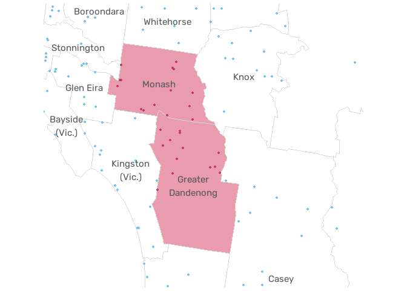
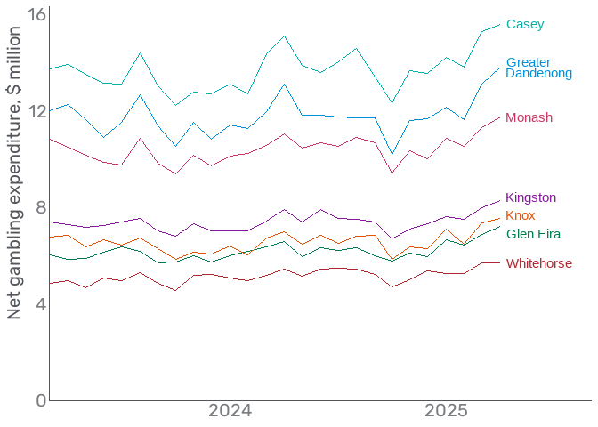
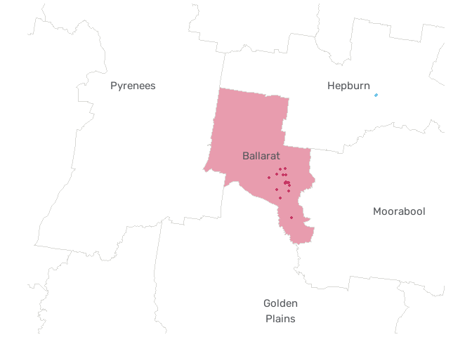
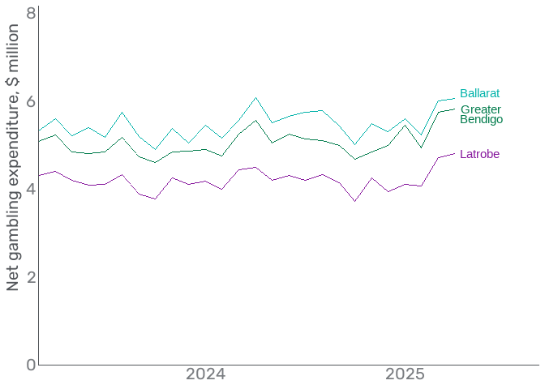
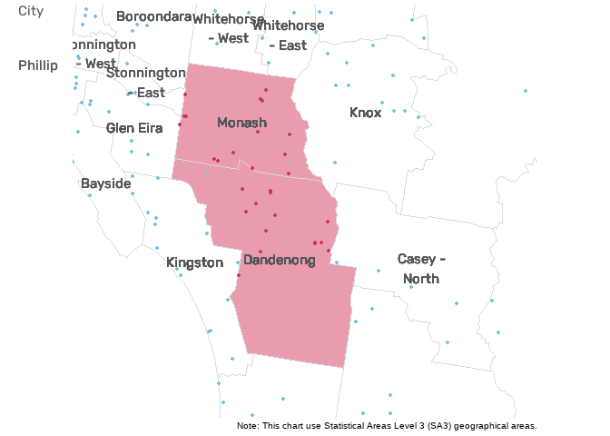
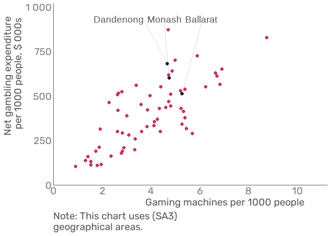

<!-- README.md is generated from README.Rmd. Please edit that file -->

# vcglR

The Victorian gambling regulator publishes gaming machine data by venue
and local government area [on its
website.](https://www.vgccc.vic.gov.au/resources/information-and-data/expenditure-data)

Released twice a year for venue data and monthly for LGA data, these
datasets include gaming expenditure at each gaming venue/local area, and
the number of gaming machines it has.

The data is published as `.xlsx` data. Historical data is also
available.

The goal of vcglR is to make Victorian gambling data available in tidy
format. The name is taken from the abbreviation of the gambling
regulators former name.

The `vcglR` package reads the `.xlsx` data, cleans it and converts it to
tidy format.

## Installation

You can install the development version of vcglR like so:

``` r
# install.packages("devtools")
devtools::install_github("zerogetsamgow/vcglR")
```

## Gaming venue data

Data is stored as `egm_venue_data.rda` and `egm_lga_data.rda` allowing
it to be loaded into R from the pacakge:

``` r
egm_data = vcglR::egm_venue_data

dplyr::glimpse(egm_data)
#> Rows: 17,044
#> Columns: 9
#> $ venue_name     <chr> "Geelong Football Club", "Geelong Football Club", "Red …
#> $ venue_type     <fct> Club, Club, Club, Club, Club, Club, Club, Club, Club, C…
#> $ lga_name       <chr> "Greater Geelong", "Greater Geelong", "Mildura", "Mildu…
#> $ financial_year <fy> 2008-09, 2008-09, 2008-09, 2008-09, 2008-09, 2008-09, 20…
#> $ fy_date        <date> 2009-06-30, 2009-06-30, 2009-06-30, 2009-06-30, 2009-0…
#> $ measure_type   <fct> Expenditure, EGM, Expenditure, EGM, Expenditure, EGM, E…
#> $ value          <dbl> 4416532.9, 100.0, 2206156.3, 34.0, 3336511.8, 83.0, 577…
#> $ lat            <dbl> -38.15760, -38.15760, -34.30460, -34.30460, -37.93730, …
#> $ long           <dbl> 144.3531, 144.3531, 142.1877, 142.1877, 145.0431, 145.0…
```

Cleaning consists of:

- updating and standardising venue names `venue_name` to the latest
  known venue name

- standardising local government areas `lga_name` to an abbreviated
  format.

- gathering quantitative data (the number of gaming machines and player
  loss) to long format and replacing missing data (0 counts of gaming
  machines). The type of data is denoted by `measure_type`, values are
  stored as `value`.

- removing half-year data - only full financial year data is retained

- cleaning the date information for each financial year and saving it as
  a character variable `financial_year` and date `fy_date` variable.

The package also adds geo-location data for each venue in the dataset.
Location data was initially sourced from the regulator’s [mapping
tool](https://geomaps.vgccc.vic.gov.au/). Missing data was added
manually and saved in `egm_locatons.csv` in `/data-raw/`

## Monthly LGA data

The Victorian gambling regulator publishes gaming machine data by LGA
[on its
website.](https://www.vgccc.vic.gov.au/resources/information-and-data/expenditure-data)

Released monthly, this dataset includes gaming expenditure for each LGA,
and the number of gaming machines and venues operating in the LGA.

The data is published as `.xlsx` data. Historical data is also
available.

The `vcglR` package reads this data, cleans it and converts it tidy
format. Data is stored as `egm_lga_data.rda` allowing it to be loaded
with:

``` r
lga_data = vcglR::egm_lga_data

dplyr::glimpse(lga_data)
#> Rows: 8,208
#> Columns: 5
#> $ lga_name       <chr> "Alpine", "Alpine", "Alpine", "Alpine", "Alpine", "Alpi…
#> $ financial_year <date> 2019-06-30, 2019-06-30, 2019-06-30, 2019-06-30, 2019-0…
#> $ data_month     <date> 2018-08-01, 2018-09-01, 2018-10-01, 2018-11-01, 2018-1…
#> $ measure_type   <chr> "Expenditure", "Expenditure", "Expenditure", "Expenditu…
#> $ value          <dbl> 224281.3, 156538.2, 202779.0, 173965.4, 179321.2, 18943…
```

Cleaning consists of:

- standardising local government areas `lga_name` to an abbreviated
  format.

- gathering quantitative data (the number of gaming machines and player
  loss) to long format. The type of data is denoted by `measure_type`,
  values are stored as `value`.

- cleaning the date information for each financial year and saving it as
  a date variable `financial_year` and month of data `data_month`
  variable.

## Last updated

Last update on 1 October 2025. As of version 0.1.3, annual data is up to
the financial year 2024-25 and monthly data is up to August 2025.

## Possible analysis

The following provides an example of some of the analysis possible with
vcglR.

The Victorian Government has announced a trial of mandatory
account-based play at select venues from September. See
<https://www.premier.vic.gov.au/new-trial-help-prevent-gambling-harm>

The trial will run across all 43 venues with gaming machines in Monash,
Greater Dandenong and Ballarat from September to November.

`vcglR` can be used by help those who want to track the effects of the
trial. The package includes `tidy` venue and LGA level gaming
expenditure and machine count data. Venue locations are also geocoded to
enable mapping and working with other data and geographic areas.

``` r

venue_data = vcglR::egm_venue_data |> 
 # filter(fy_date == max(fy_date)) |> 
  select(contains("name"), contains("type"), value, lat, long, fy_date, financial_year) |> 
  mutate(is_trial = str_detect(lga_name, "Monash|Dandenong|Ballarat"))


lga_shapes =
  strayr::read_absmap("lga2021", remove_year_suffix = TRUE) |> 
  filter(state_code == 2) |> 
  mutate(is_trial = str_detect(lga_name, "Monash|Dandenong|Ballarat"))
```

Some early observations.

The trial in metropolitan LGAs should provide easily accessible data to
measure the effect on gambling expenditure, noting we will be able to
compare Monash and Dandenong with neighbouring LGAs. There are also some
risks of players shifting to neighbouring venues to avoid the trial.



I will update the package as monthly data is released, so it will be
possible to observe any effect on expenditure using the LGA level data
as shown below.



Gaming machines in Ballarat have few substitutes, so players will find
it more difficult to move to neighbouring venues to avoid the trial.



This means comparisons for Ballarat will need to be made against similar
regional centres rather than neighbouring LGAs. For example.



As venue data in the package is geocoded it supports analysis using
other geographies like Statistical Areas.




